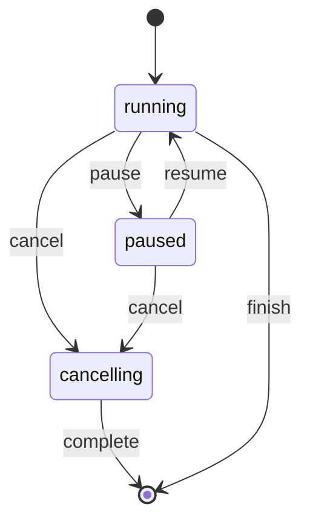

# Processing & Crunchers

## Concepts

- **Service:** A registered processing backend (e.g., OCR, NER, image processing). Services register with the platform and advertise their capabilities.
- **Cruncher:** The UI term for a processing task offered by a service. Each service exposes one or more cruncher tasks.
- **Batch:** A group of processing jobs (e.g., running OCR on all files in a set). Has lifecycle states: running → paused/cancelling → finished.

**Verified from:** `src/features/services/crunchers/`, `src/web.js` (batch methods), `src/components/GraphDisplay.vue` (process tracking)

## Processing Scope

Processing can be triggered at three levels:

| Scope | API Pattern | Trigger |
|-------|-------------|---------|
| Single file | `POST /api/queue/:service/files/:rid` | From cruncher list on selected node |
| Set (batch) | `POST /api/queue/:service/sets/:rid` | From cruncher list on set node |
| Source | `POST /api/queue/:service/sources/:rid` | From source node processing |
| ROI | `POST /api/queue/:service/files/:rid/roi` | ROI-specific processing |
| **Auto-import** | Automatic on PDF upload | `afterFileCreated()` in import pipeline |

**Verified from:** `src/web.js` (`createFileProcess`, `createSetProcess`, `createSourceProcess`, `createROIProcess`)

### PDF Auto-Import

PDF uploads automatically trigger the split pipeline without user action. The Process node has `role: 'import'`, which causes ProcessingNode.vue to display "Importing…" instead of "Crunching…". Files with `processable: false` (non-splitter PDF outputs) only show the split cruncher in CruncherList.

**Verified from:** `src/components/nodes/ProcessingNode.vue`, `src/components/Uploader.vue`

### Set Locking After Batch Processing

A Set becomes read-only for uploads once it has been used as the input of a batch cruncher run
(a `SetProcess`/`DERIVED_FROM` edge with `process_rid` where `@in` is the Set's rid — see MessyDesk's
`graph.mjs` `connectDerivedFrom`/`hasSetBeenProcessed`/`getProcessedSetRids`). This is a hard rule, not
a soft warning: there is no supported way to re-run or extend a finished batch to also cover files added
afterwards.

- Backend: `POST /api/projects/{rid}/upload/{set}` calls `Graph.hasSetBeenProcessed(setRid)` and responds
  `409 Conflict` if the Set has already been processed, before any file is written.
- Frontend: the graph query that hydrates Set nodes (`getSetThumbnails` in `graph.mjs`) attaches a bulk-computed
  `processed` boolean to each Set node's data via `Graph.getProcessedSetRids`. `GraphDisplay.vue` copies this
  flag onto the vue-flow node. `NodeCard.vue`'s `setLocked` computed reads it to swap the "Upload image to set"
  button for a warning alert.

**Verified from:** `src/routes/files.mjs`, `src/graph.mjs` (MessyDesk), `src/components/NodeCard.vue`,
`src/components/GraphDisplay.vue`

## Cruncher Selection UI (`features/services/crunchers/CruncherPicker.vue`)

The cruncher dialog lives in `GraphMain.vue` and is opened by:
1. Setting `store.current_node` to the target node
2. Optionally setting `store.cruncher_filter` to filter by format
3. Setting `store.crunchers_open = true`

`GraphMain` passes the node (`{ id, type }`) and the filter to `CruncherPicker`, which has no dependency on the old store. The picker fetches services compatible with the node via `getServicesForFile(file_rid, filter)` and emits `done` (`{ reload }`) when it has started a process (no reload; the new node arrives over SSE) or created a filter (reload). The pure parts (catalogue preparation, categories, search, building the process request, choosing the queue endpoint) are in `crunchers.js`.

The endpoint depends on the node: `source` → `createSourceProcess`, a set (`set` or `*-set`) → `createSetProcess`, `cruncher_filter === 'ROI'` → `createROIProcess`, otherwise `createFileProcess`.

A search field at the top filters client-side across service/task/filter `name`, `description` and `id`. While a query is entered, the category tabs are replaced by a flat matching list (each result tagged with its category); clearing the search restores the tabbed view.

It groups services and filters into tabs by `category` (from `service.json`/`filter.json`, see [service-descriptor-format.md](../../MessyDesk/wiki/service-descriptor-format.md) in MessyDesk):
- **Preparation & annotation** — includes Filters and ROIs alongside regular services
- **Linguistic & statistical analysis**
- **Task-specific machine learning**
- **Generative AI**
- **Uncategorized** — shown only when a service/filter is missing a valid `category`

A 5th category, `system`, marks internal-only services/filters. The backend excludes them from `getServicesForNode()`/the filters list entirely, so they never appear in any tab.

Within each category tab, services are listed with their tasks nested inside (one expansion panel per service, tasks shown when expanded). There is no separate "By Crunchers" flat list or "Filters and ROIs" tab anymore — filters render as additional entries within their category's panel list.

Each service card shows metadata:
- Access type: open source / proprietary
- Location: on-premise / external (with data warning)
- Status: stable / experimental
- Model selection (if service offers multiple models)

**Verified from:** `src/features/services/crunchers/CruncherPicker.vue`, `crunchers.js`

## Service Metadata Shape

```js
{
  id: 'service-id',
  name: 'Human-readable name',
  description: 'What it does',
  source_url: 'https://...',
  access: 'open' | 'proprietary',
  location: 'local' | 'external',
  status: 'stable' | 'experimental',
  category: 'preparation' | 'linguistic' | 'ml' | 'generative', // optional; missing/invalid -> Uncategorized tab
  supported_types: ['image', 'text', ...],
  supported_formats: ['jpg', 'png', ...],
  consumers: [...],        // active consumer instances
  nomad: Boolean,          // orchestrated via Nomad
  models: { model_id: { name, description, output } },
  tasks: { task_id: { name, description, params_help } }
}
```

**Inferred from:** `src/features/services/crunchers/CruncherService.vue`, `src/features/services/ServicesPage.vue` (template bindings)

### `params_help` display types

Each `params_help.<key>` entry is rendered by `crunchers/ParamField.vue` based on its `display` field (tasks without `params_help` use the service's):

| `display` | Control |
|-----------|---------|
| (default/none) | Plain text input, bound to `task.values[key]` as a string |
| `checkbox` | Single checkbox, or one checkbox per `values` entry if `values` is an array |
| `dropdown` | `v-select` over `values` |
| `tagpicker` | `crunchers/TagPickerField.vue` \u2014 toggles between free-form comma-string entry (same as default) and picking from the user's existing Tag entities (with descriptions), plus an inline "define a new tag" form. In pick mode, `task.values[key]` becomes a JSON array of `{label, description}` instead of a string. This is a per-task opt-in (set on the specific task's `params_help`, not the whole service): MD-Gliner2's `classify_text` uses it for its `labels` param (whole-document category, maps cleanly onto a fixed tag), but `extract_entities` (NER) deliberately does not \u2014 it extracts many per-mention spans per label, so it isn't restricted to/linked with a fixed existing-tag set the same way (see MessyDesk's `tags.md` \u00a78 step 8, and [graph-data-model.md](../../MessyDesk/wiki/architecture/graph-data-model.md#entitytag-system) for how `Tag.description` and `autotagNerFile`'s reuse-by-label matching interact) |
| `component: 'dspace'` | `crunchers/DspaceQueryForm.vue` (query building in `dspaceQuery.js`; special-cased before `display` is checked) |

## Process Tracking and Progress

### BatchProgressPanel (Floating Panel)

A persistent floating panel (`src/components/BatchProgressPanel.vue`) is rendered in `src/app/App.vue` outside the router-view. It is visible whenever there are active batch jobs and shows:
- Service name and status (running/paused/cancelling/failed)
- Progress: processed files / total files / failed files
- ETA (when available)
- Progress bar (color-coded by status)
- Pause/Resume/Cancel buttons per job

The panel reads from `batchStore.jobs` reactively.

### Graph View Banners

GraphDisplay.vue also shows running process banners at the top of the graph view with the same controls. These read from the local `state.running_processes` which mirrors `store.running_processes`.

### Progress Update Flow

1. A single SSE connection is managed by `src/services/events.js` (opened on app mount in `src/app/App.vue`)
2. SSE events are parsed and routed to `batchStore.handleEvent()` for batch state
3. Graph-specific events (`add`, `update`, `add_and_finish`) are dispatched as `window` custom events (`md-sse`)
4. `GraphDisplay.vue` listens for `md-sse` events to update the visual graph
5. On SSE reconnect, `batchStore.hydrate()` fetches active jobs from `GET /api/queue/jobs/active`

**No polling timer.** All progress is SSE-driven with hydration on reconnect.

### Batch Lifecycle



**Verified from:** `src/stores/batchStore.js`, `src/services/events.js`, `src/components/BatchProgressPanel.vue`

