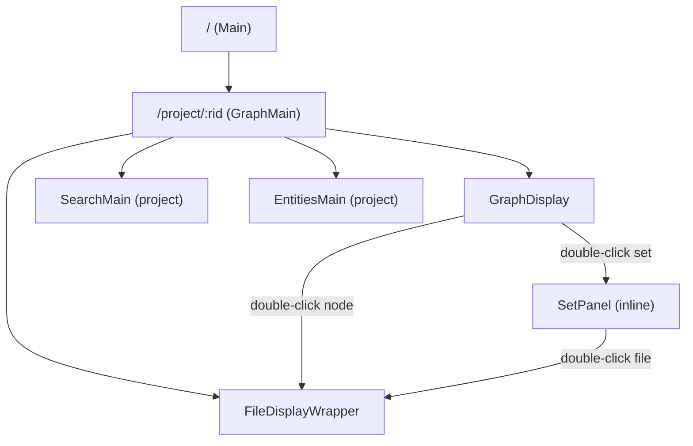

# Routing

## Router Setup

The router uses `createWebHistory` with `VITE_PUBLIC_PATH` as the base. Routes are defined statically in `src/main.js`—there is no lazy loading or code splitting.

**Verified from:** `src/main.js`

## Route Table

| Path | Name | Component | Notes |
|------|------|-----------|-------|
| `/` | Home | `Main` | Project listing & dashboard |
| `/graph` | — | redirect | Legacy: redirects `?node=xxx` → `/project/xxx` |
| `/project/:rid` | — | `GraphMain` | Shell for project views (nested routes) |
| `/project/:rid` (child `''`) | project-graph | `GraphDisplay` | Graph canvas |
| `/project/:rid/search` | project-search | `SearchMain` | Project-scoped search |
| `/project/:rid/entities` | project-entities | `EntitiesMain` | Project-scoped tags |
| `/project/:rid/file/:fileRid` | project-file | `FileDisplayWrapper` | File viewer |
| `/services` | services | `ServicesMain` | Service catalog |
| `/intro` | introduction | `Introduction` | Onboarding page |
| `/files/:rid` | files | `FilesMain` | File browser |
| `/crunchers` | crunchers | `CrunchersMain` | All crunchers view |
| `/search` | search | `SearchMain` | Global search |
| `/prompts` | prompts | `PromptsMain` | Saved prompts |
| `/help/:slug?` | help | `HelpMain` | General help |
| `/help/services/:service/` | service-help | `HelpMain` | Per-service help |
| `/help/services/:service/:assetPath(.*)*` | service-help-asset | `HelpMain` | Help asset resolution |
| `/tags` | tags | redirect → entities | Legacy alias |
| `/entities` | entities | `EntitiesMain` | Global entity/tag browser |
| `/admin` | admin | `AdminMain` | Admin panel |
| `/about` | about | `About` | About page |
| `/login` | login | `Login` | SSO permission request page |

**Verified from:** `src/main.js` (route definitions)

## Key Routing Patterns

### Project Context (Nested Routes)

`/project/:rid` is a nested route shell (`GraphMain`). The shell provides:
- The app bar/header with tabs (Desk, Search, Tags)
- Shared sidepanel (NodeCard) when in graph view
- Dialogs (Uploader, NodeDeleter, SetCreator, SourceCreator)

Child routes render in a `<router-view>` that uses `keep-alive` to cache `GraphDisplay`.

**Verified from:** `src/components/GraphMain.vue` template

### File Navigation via Browse Context

When opening a file from a set, the route includes query parameters (`browseMode`, `setRid`, `setLabel`, `fileCount`, `skip`, `sourceRid`, `sourceLabel`) that encode the browsing context. `FileDisplayWrapper` can hydrate `store.file_browse_context` from these query params on mount, enabling next/prev navigation within a set.

**Verified from:** `src/components/displays/FileDisplayWrapper.vue` (`hydrateBrowseContextFromRouteQuery`)

### Legacy Graph Route Redirect

The old URL pattern `/graph?node=xxx` is redirected to `/project/xxx` for backward compatibility.

**Verified from:** `src/main.js`

## Navigation Flow

